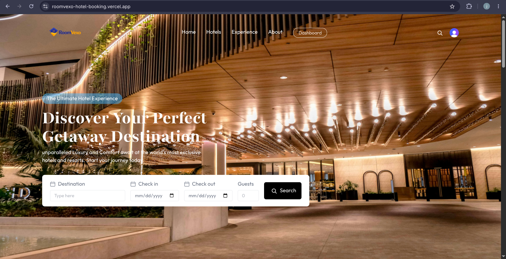
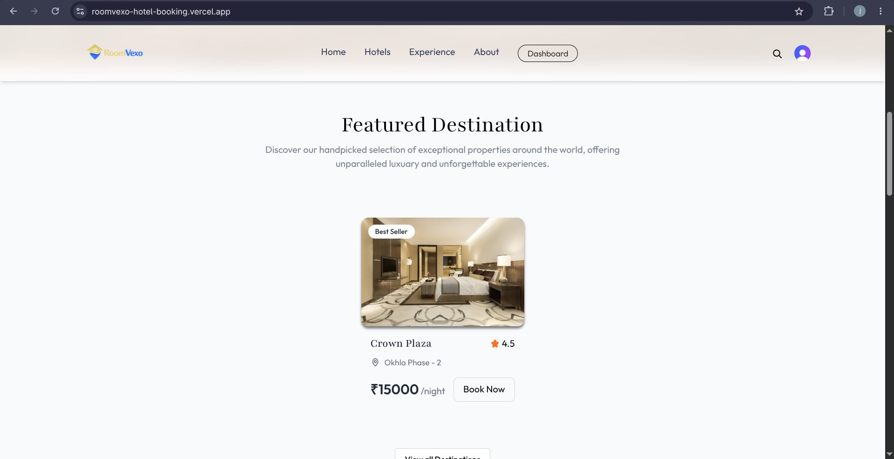
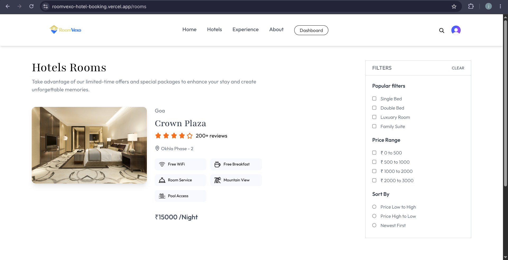
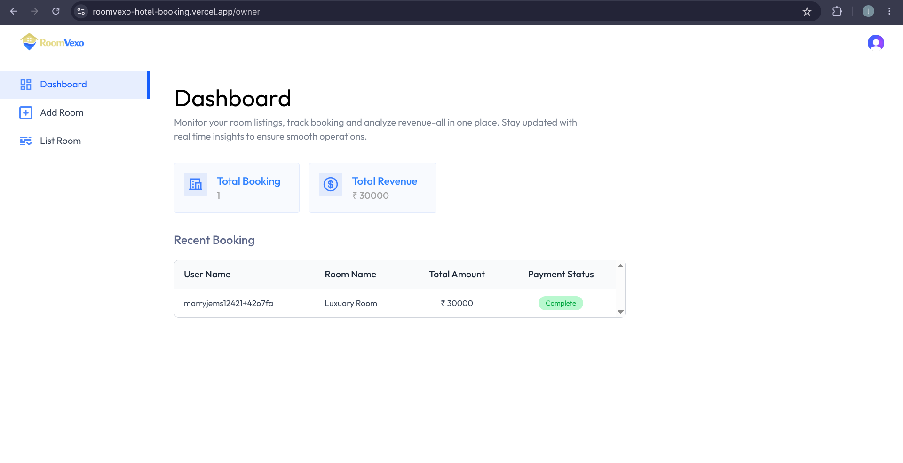
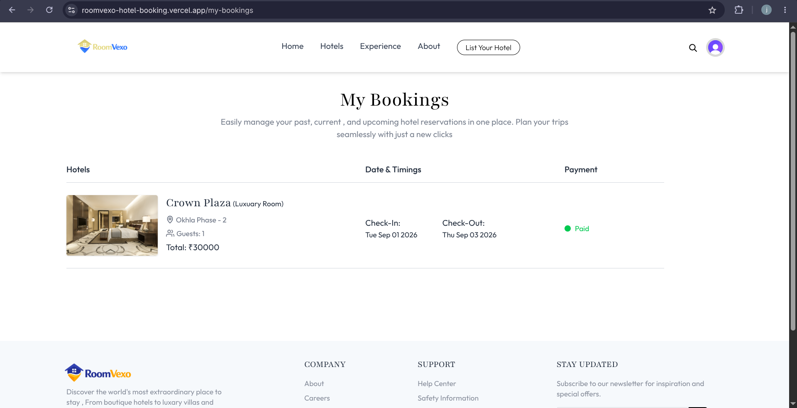

# RoomVexo — Hotel Booking Platform

A full-stack MERN hotel booking application where guests can browse, filter, and book hotel rooms, and hotel owners can register their property, manage rooms, and track bookings and revenue from a dedicated dashboard.

**Live Demo:** [roomvexo-hotel-booking.vercel.app](https://roomvexo-hotel-booking.vercel.app)

---

## Features

### For Guests
- Browse and search hotels by destination, room type, and price range
- View detailed room pages with amenities, images, and pricing
- Real-time availability check before booking
- Secure online payment via Razorpay, or pay-at-hotel option
- View and manage personal bookings ("My Bookings")
- Personalized "Recommended Hotels" based on recent searches
- Booking confirmation emails sent automatically

### For Hotel Owners
- Register a hotel directly from the app
- Add rooms with multiple images, pricing, and amenities
- Toggle room availability on/off
- Dashboard with total bookings, total revenue, and a recent bookings table
- Revenue is calculated only from confirmed (paid) bookings

### Platform
- Authentication and session management via Clerk (Google/email sign-in)
- User data synced to MongoDB automatically via Clerk webhooks
- Image uploads and hosting via Cloudinary
- Payments processed via Razorpay, with both client-side verification and a server-side webhook for reliability
- Transactional emails via Resend

---

## Tech Stack

**Frontend**
- React 19 + Vite
- React Router v7
- Tailwind CSS v4
- Clerk (`@clerk/clerk-react`) for authentication
- Axios for API calls
- React Hot Toast for notifications

**Backend**
- Node.js + Express 5
- MongoDB + Mongoose
- Clerk (`@clerk/express`) for auth middleware
- Cloudinary for image storage
- Multer for file upload handling
- Razorpay for payments
- Resend for transactional emails
- Svix for webhook signature verification

**Deployment**
- Vercel (separate deployments for client and server)

---

## Project Structure

```
roomvexo/
├── client/                      # React frontend
│   ├── src/
│   │   ├── assets/              # Images, icons, static content
│   │   ├── components/          # Reusable UI components
│   │   │   └── hotelOwner/      # Owner-specific components (Navbar, Sidebar)
│   │   ├── context/             # AppContext — global state (user, rooms, auth)
│   │   ├── pages/                
│   │   │   └── hotelOwner/      # Dashboard, Add Room, List Room
│   │   ├── App.jsx
│   │   └── main.jsx
│   ├── index.html
│   └── package.json
│
├── server/                      # Express backend
│   ├── configs/                 # DB, Cloudinary, Resend, Razorpay configs
│   ├── controllers/             # Route handlers (business logic)
│   ├── middleware/               # Auth (Clerk) and file upload middleware
│   ├── models/                  # Mongoose schemas (User, Hotel, Room, Booking)
│   ├── routes/                  # Express route definitions
│   ├── server.js
│   └── package.json
│
└── README.md
```

---

## Getting Started

### Prerequisites
- Node.js 18+
- A MongoDB Atlas cluster (or local MongoDB instance)
- Accounts on: [Clerk](https://clerk.com), [Cloudinary](https://cloudinary.com), [Razorpay](https://razorpay.com), [Resend](https://resend.com)

### 1. Clone the repository
```bash
git clone <your-repo-url>
cd roomvexo
```

### 2. Backend setup
```bash
cd server
npm install
```

Create a `.env` file in `server/`:
```env
PORT=3000
MONGODB_URI=your_mongodb_connection_string

CLERK_PUBLISHABLE_KEY=your_clerk_publishable_key
CLERK_SECRET_KEY=your_clerk_secret_key
CLERK_WEBHOOK_SECRET=your_clerk_webhook_signing_secret

CLOUDINARY_CLOUD_NAME=your_cloudinary_cloud_name
CLOUDINARY_API_KEY=your_cloudinary_api_key
CLOUDINARY_API_SECRET=your_cloudinary_api_secret

RESEND_API_KEY=your_resend_api_key

RAZORPAY_KEY_ID=your_razorpay_key_id
RAZORPAY_KEY_SECRET=your_razorpay_key_secret
RAZORPAY_WEBHOOK_SECRET=your_razorpay_webhook_secret
```

Run the server:
```bash
npm run server    # with nodemon, for development
# or
npm start         # plain node, for production
```

### 3. Frontend setup
```bash
cd ../client
npm install
```

Create a `.env` file in `client/`:
```env
VITE_CLERK_PUBLISHABLE_KEY=your_clerk_publishable_key
VITE_BACKEND_URL=http://localhost:3000
VITE_CURRENCY=₹
```

Run the client:
```bash
npm run dev
```

### 4. Webhook setup (required for full functionality)

**Clerk webhook** — in the Clerk Dashboard, add a webhook endpoint pointing to:
```
https://your-backend-url/api/clerk
```
Subscribe to `user.created`, `user.updated`, and `user.deleted` events.

**Razorpay webhook** — in the Razorpay Dashboard, add a webhook endpoint pointing to:
```
https://your-backend-url/api/payment/razorpay/webhook
```
Subscribe to the `payment.captured` event, and set the webhook secret to match `RAZORPAY_WEBHOOK_SECRET`.

> Webhooks require a publicly reachable URL — they will not work against `localhost`. Use a deployed backend or a tunneling tool (e.g. ngrok) for local webhook testing.

---

## Deployment

Both `client` and `server` are deployed as **separate Vercel projects**.

1. Push the repository to GitHub.
2. Import `client` and `server` as two separate projects in Vercel.
3. Add all environment variables listed above to each project's Vercel dashboard (**Settings → Environment Variables**).
4. Environment variables in Vite are baked in at build time — after adding or changing them, trigger a fresh deployment for changes to take effect.
5. Update the `CLERK_WEBHOOK_SECRET` / `RAZORPAY_WEBHOOK_SECRET` webhook URLs in their respective dashboards to point to the deployed backend URL.

---

## Core Flows

**Guest → Booking:** Browse rooms → check availability → book (default: Pay at Hotel) → optionally pay online via Razorpay from "My Bookings" → booking marked as paid (via client-side verification and/or webhook, whichever completes first).

**User → Hotel Owner:** Any logged-in user can register a hotel via "List Your Hotel". Doing so automatically upgrades their role to `hotelOwner`, unlocking the owner Dashboard, Add Room, and List Room pages.

**Payments:** Razorpay orders are created server-side with the booking ID attached as order notes, so the webhook can reliably map a captured payment back to the correct booking even if the user's browser closes before the client-side verification call completes.

---

## Testing Checklist

For a complete end-to-end test, use **two separate accounts** — one as a hotel owner, one as a guest — since "My Bookings" and the owner "Dashboard" show different, non-overlapping data (a user's own bookings vs. bookings made *at their hotel*).

1. Sign up (Account A) → register a hotel → add a room
2. Sign up (Account B, different browser/incognito) → book Account A's room with valid check-in/check-out dates
3. Confirm the booking appears in Account B's "My Bookings"
4. Confirm the same booking appears in Account A's Dashboard
5. Pay for the booking via Razorpay test mode (UPI: `success@razorpay`, or a domestic test card)
6. Confirm `isPaid` updates to `true` and revenue reflects on the Dashboard

---

## Screenshots

### Home Page


### Featured Destinations


### Hotel Listings with Filters


### Owner Dashboard


### My Bookings


---

## License

This project is for educational/portfolio purposes.
